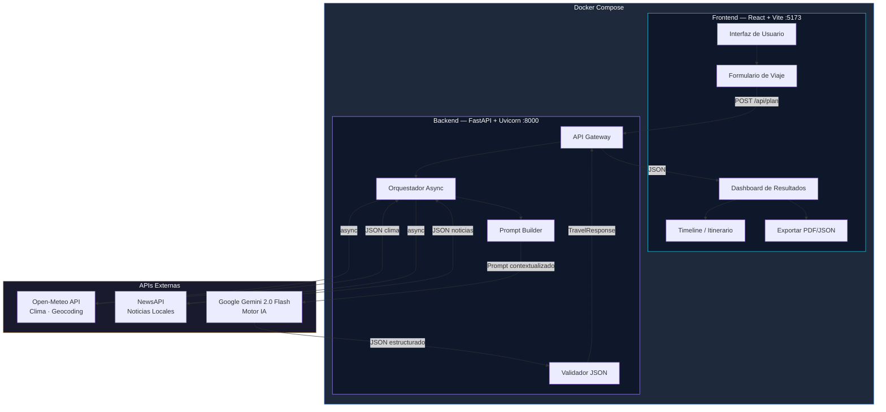
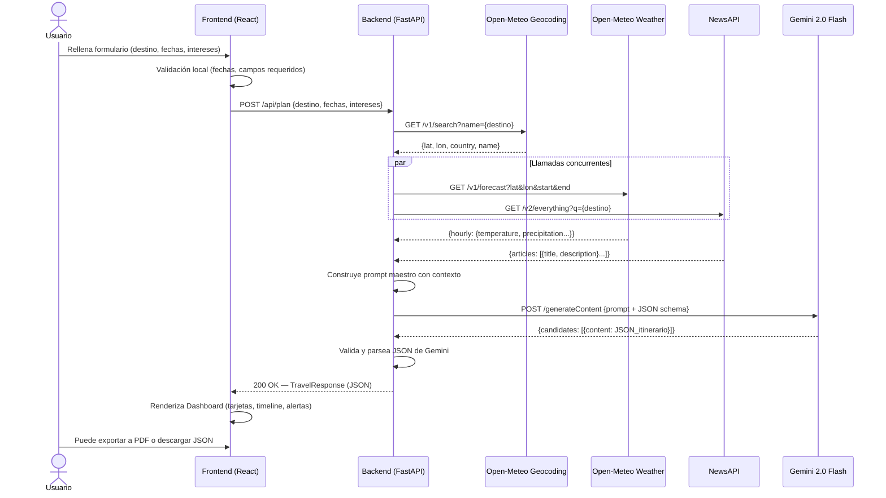
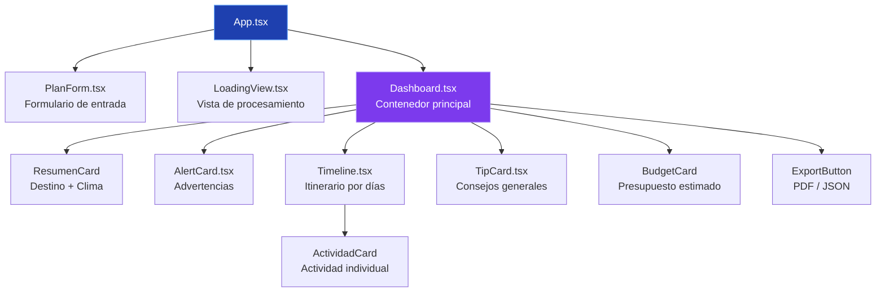
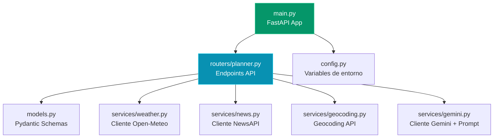

# Arquitectura — Voyager AI

## Diagrama de Arquitectura General

```mermaid
graph TB
    subgraph Docker["Docker Compose"]
        subgraph FE["Frontend — React + Vite :5173"]
            UI[Interfaz de Usuario]
            Form[Formulario de Viaje]
            Dashboard[Dashboard de Resultados]
            Timeline[Timeline / Itinerario]
            Export[Exportar PDF/JSON]
        end

        subgraph BE["Backend — FastAPI + Uvicorn :8000"]
            API[API Gateway]
            Orchestrator[Orquestador Async]
            PromptBuilder[Prompt Builder]
            Validator[Validador JSON]
        end
    end

    subgraph External["APIs Externas"]
        OpenMeteo[Open-Meteo API\nClima · Geocoding]
        NewsAPI[NewsAPI\nNoticias Locales]
        Gemini[Google Gemini 2.0 Flash\nMotor IA]
    end

    UI --> Form
    Form -->|POST /api/plan| API
    API --> Orchestrator
    Orchestrator -->|async| OpenMeteo
    Orchestrator -->|async| NewsAPI
    OpenMeteo -->|JSON clima| Orchestrator
    NewsAPI -->|JSON noticias| Orchestrator
    Orchestrator --> PromptBuilder
    PromptBuilder -->|Prompt contextualizado| Gemini
    Gemini -->|JSON estructurado| Validator
    Validator -->|TravelResponse| API
    API -->|JSON| Dashboard
    Dashboard --> Timeline
    Dashboard --> Export

    style Docker fill:#1e293b,stroke:#3b82f6,color:#fff
    style FE fill:#0f172a,stroke:#22d3ee,color:#fff
    style BE fill:#0f172a,stroke:#a78bfa,color:#fff
    style External fill:#1a1a2e,stroke:#f59e0b,color:#fff
```

## Diagrama de Secuencia — Flujo Principal

```mermaid
sequenceDiagram
    actor U as Usuario
    participant FE as Frontend (React)
    participant BE as Backend (FastAPI)
    participant GEO as Open-Meteo Geocoding
    participant WX as Open-Meteo Weather
    participant NW as NewsAPI
    participant AI as Gemini 2.0 Flash

    U->>FE: Rellena formulario (destino, fechas, intereses)
    FE->>FE: Validación local (fechas, campos requeridos)
    FE->>BE: POST /api/plan {destino, fechas, intereses}
    
    BE->>GEO: GET /v1/search?name={destino}
    GEO-->>BE: {lat, lon, country, name}
    
    par Llamadas concurrentes
        BE->>WX: GET /v1/forecast?lat&lon&start&end
        BE->>NW: GET /v2/everything?q={destino}
    end
    
    WX-->>BE: {hourly: {temperature, precipitation...}}
    NW-->>BE: {articles: [{title, description}...]}
    
    BE->>BE: Construye prompt maestro con contexto
    BE->>AI: POST /generateContent {prompt + JSON schema}
    AI-->>BE: {candidates: [{content: JSON_itinerario}]}
    
    BE->>BE: Valida y parsea JSON de Gemini
    BE-->>FE: 200 OK — TravelResponse (JSON)
    
    FE->>FE: Renderiza Dashboard (tarjetas, timeline, alertas)
    U->>FE: Puede exportar a PDF o descargar JSON
```

## Diagrama de Componentes Frontend

```mermaid
graph TB
    App[App.tsx]
    App --> PlanForm[PlanForm.tsx\nFormulario de entrada]
    App --> LoadingView[LoadingView.tsx\nVista de procesamiento]
    App --> Dashboard[Dashboard.tsx\nContenedor principal]
    
    Dashboard --> ResumenCard[ResumenCard\nDestino + Clima]
    Dashboard --> AlertCards[AlertCard.tsx\nAdvertencias]
    Dashboard --> TimelineView[Timeline.tsx\nItinerario por días]
    Dashboard --> TipCards[TipCard.tsx\nConsejos generales]
    Dashboard --> BudgetCard[BudgetCard\nPresupuesto estimado]
    Dashboard --> ExportBtn[ExportButton\nPDF / JSON]
    
    TimelineView --> ActividadCard[ActividadCard\nActividad individual]

    style App fill:#1e40af,stroke:#60a5fa,color:#fff
    style Dashboard fill:#7c3aed,stroke:#a78bfa,color:#fff
```

## Diagrama de Módulos Backend

```mermaid
graph TB
    Main[main.py\nFastAPI App]
    Main --> Router[routers/planner.py\nEndpoints API]
    Main --> Config[config.py\nVariables de entorno]
    
    Router --> Models[models.py\nPydantic Schemas]
    Router --> WeatherSvc[services/weather.py\nCliente Open-Meteo]
    Router --> NewsSvc[services/news.py\nCliente NewsAPI]
    Router --> GeoSvc[services/geocoding.py\nGeocoding API]
    Router --> GeminiSvc[services/gemini.py\nCliente Gemini + Prompt]

    style Main fill:#059669,stroke:#34d399,color:#fff
    style Router fill:#0891b2,stroke:#22d3ee,color:#fff
```
